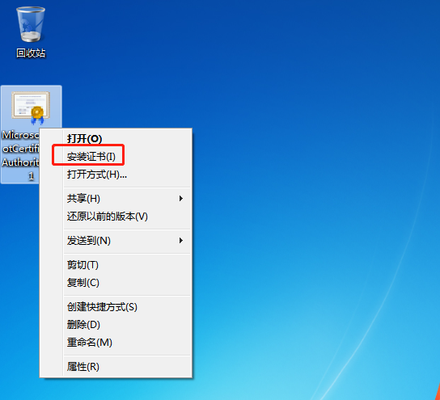
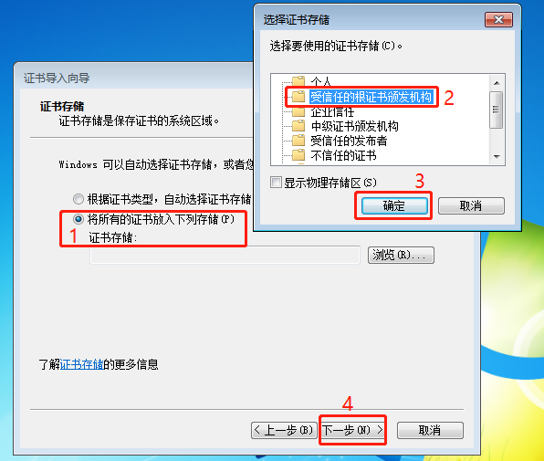

今天发现一个WPF程序在Win7上有兼容性问题，但是从log看不出有啥问题，于是搭了一个Win7的虚拟机环境，但上去装[Visual Studio 2019远程调试工具](https://visualstudio.microsoft.com/zh-hans/downloads/#remote-tools-for-visual-studio-2019)时竟然提示“处理证书链,但是在不受信任提供程序信任的根证书中终止...”，心想这不会是个流氓软件吧？但我是从MS官网下载的啊...找了goole一下，应该是**vs2019调试工具中的证书在win7的证书库中不存在**导致的，因为无论是vs2019还是Framework 4.5.2+，这都是Win 10的产物了，故win7上表现异常也是能理解的。

于是在MS上下载这个证书安装即可：[下载地址](http://go.microsoft.com/fwlink/?linkid=747875&clcid=0x409)

### 安装步骤：

1. 单击选择证书=>右键=>安装证书

2. 选择存储位置“本地计算机”，点击下一步
3. 选择“将所有的证书都放入下列存储”，点击“浏览”
4. 选择“受信任的根证书颁发机构”，点击确定

5. 点击“下一步”，点击“完成”
6. 尝试重新安装程序